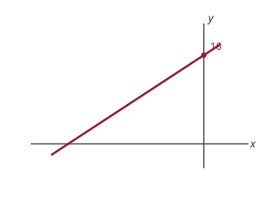
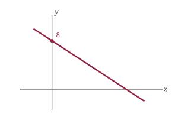
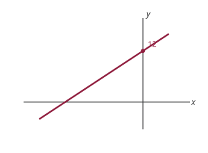

Problem numbers refer to the textbook (Chiang & Wainwright, 4th edition). These are not graded, but you should attempt them all before the quiz. Most parts have their own **Solution** toggle: try it yourself first, then expand to check.

## Exercise 2.4

**5.** If the domain of the function $y=5+3x$ is the set $\{x \mid 1 \leq x \leq 9\}$, find the range of the function and express it as a set.

Solution

For this function, when $x=1$, $y=8$, and when $x=9$, $y=32$. So the range is
$$ f(X) =\{y \mid 8 \leq y \leq 32\} $$

Note: it is *not* always the case that extreme values of the domain correspond to extreme values of the range. For example, consider $y=x^{2}$ with domain $\{x \mid -2 \leq x \leq 2\}$; the range here is $\{y \mid 0 \leq y \leq 4\}$.

**7.** In the theory of the firm, economists consider the total cost $C$ to be a function of the output level $Q$: $C=f(Q)$.

   a. According to the definition of a function, should each cost figure be associated with a unique output level?
   b. Should each level of output determine a unique cost figure?

Solution

a. No
b. Yes

**8.** If an output level $Q_1$ can be produced at a cost of $C_1$, then it must also be possible (by being less efficient) to produce $Q_1$ at a cost of $C_1+\$1$, or $C_1+\$2$, and so on. Thus it would seem that output $Q$ does not uniquely determine total cost $C$. If so, to write $C=f(Q)$ would violate the definition of a function. How, in spite of this reasoning, would you justify the use of the function $C=f(Q)$?

Solution

For each output level, we would want to produce at the *lowest* cost. The cost function $C=f(Q)$ records that minimum cost, which is unique.

## Exercise 2.5

**1.** Graph the following functions and find their inverse functions.

a. $y = 16 + 2x$

Solution

$f^{-1}(y) = \dfrac{y-16}{2}$

{fig-alt="Graph of the straight line y equals 16 plus 2x: an upward-sloping line with slope 2 crossing the y-axis at 16" width=250}

b. $y = 8-2x$

Solution

$f^{-1}(y) = \dfrac{8-y}{2}$

{fig-alt="Graph of the straight line y equals 8 minus 2x: a downward-sloping line with slope negative 2 crossing the y-axis at 8" width=250}

c. $y = 2x+12$

Solution

$f^{-1}(y) = \dfrac{y-12}{2}$

{fig-alt="Graph of the straight line y equals 2x plus 12: an upward-sloping line with slope 2 crossing the y-axis at 12" width=250}

## Exercise 4.2

**6.** Expand the following summation expressions:

a. $\sum_{i=2}^5 x_i$

Solution

$x_{2}+x_{3}+x_{4}+x_{5}$

b. $\sum_{i=5}^8 a_i x_i$

Solution

$a_{5} x_{5}+a_{6} x_{6}+a_{7} x_{7}+a_{8} x_{8}$

c. $\sum_{i=1}^4 b x_i$

Solution

$b x_{1}+b x_{2}+b x_{3}+b x_{4}$

d. $\sum_{i=1}^n a_i x^{i-1}$

Solution

$a_{1}+a_{2} x+a_{3} x^{2}+\ldots+a_{n} x^{n-1}$

e. $\sum_{i=0}^3(x+i)^2$

Solution

$x^{2}+(x+1)^{2}+(x+2)^{2}+(x+3)^{2}$

**8.** Show that the following are true:

a. $\left(\sum_{i=0}^n x_i\right)+x_{n+1}=\sum_{i=0}^{n+1} x_i$

Solution

$$ \left(\sum_{i=0}^{n} x_{i} \right)+x_{n+1} = x_{0}+x_{1}+x_{2}+\ldots+x_{n+1} = \sum_{i=0}^{n+1} x_{i} $$

b. $\sum_{j=1}^n a b_j y_j=a \sum_{j=1}^n b_j y_j$

Solution

$$ \begin{aligned}
\sum_{j=1}^{n} a b_{j} y_{j} &= a b_{1} y_{1}+a b_{2} y_{2}+\ldots+a b_{n} y_{n} \\
&= a\left(b_{1} y_{1}+b_{2} y_{2}+\ldots+b_{n} y_{n}\right) \\
&= a \sum_{j=1}^{n} b_{j} y_{j}
\end{aligned} $$

c. $\sum_{j=1}^n\left(x_j+y_j\right)=\sum_{j=1}^n x_j+\sum_{j=1}^n y_j$

Solution

$$ \begin{aligned}
\sum_{j=1}^{n}\left(x_{j}+y_{j}\right)
&= \left(x_{1}+y_{1}\right)+\left(x_{2}+y_{2}\right)+\ldots+\left(x_{n}+y_{n}\right) \\
&= x_{1}+x_{2}+\ldots+x_{n}+y_{1}+y_{2}+\ldots+y_{n} \\
&= \sum_{j=1}^{n} x_{j}+\sum_{j=1}^{n} y_{j}
\end{aligned} $$

## Exercise 5.1

**1.** In the following paired statements, let $p$ be the first statement and $q$ the second. Which is true for each case: $p \Rightarrow q$, $p \Leftarrow q$, or $p \Leftrightarrow q$?

a. It is a holiday; it is Thanksgiving Day.

Solution

$q \implies p$

b. A geometric figure has four sides; it is a rectangle.

Solution

$q \implies p$

c. Two ordered pairs $(a, b)$ and $(b, a)$ are equal; $a$ is equal to $b$.

Solution

$q \iff p$

d. A number is rational; it can be expressed as a ratio of two integers.

Solution

$q \iff p$

e. A $4 \times 4$ matrix is nonsingular; the rank of the $4 \times 4$ matrix is 4. (*skip for now*)

Solution

$q \iff p$

f. The gasoline tank in my car is empty; I cannot start my car.

Solution

$p \implies q$

g. The letter is returned to the sender with the marking "addressee unknown"; the sender wrote the wrong address on the envelope.

Solution

$q \implies p$

