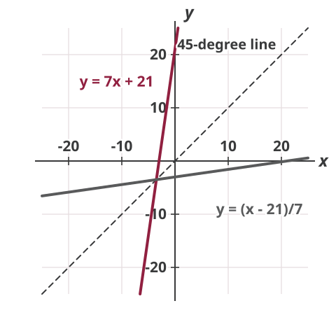

Problem numbers refer to the textbook (Chiang & Wainwright, 4th edition). These are not graded, but you should attempt them all before the quiz. Try each question yourself first, then expand the **Solution** to check.

## Exercise 7.1

**3.** Find $f'(1)$ and $f'(2)$ for the following functions:

a. $y=f(x)=18x$

Solution

$$f'(x)=18$$

$$f'(1)=18 \quad f'(2)=18$$

b. $y=f(x)=cx^{3}$

Solution

$$f'(x)=3cx^{2}$$

$$f'(1)=3c \quad f'(2)=12c$$

c. $f(x)=-5x^{-2}$

Solution

$$f'(x)=10x^{-3}$$

$$f'(1)=10 \quad f'(2)=\frac{10}{8}=\frac{5}{4}$$

d. $f(x)=\frac{3}{4}x^{4/3}$

Solution

$$f'(x)=x^{1/3}=\sqrt[3]{x}$$

$$f'(1)=1 \quad f'(2)=\sqrt[3]{2}$$

e. $f(w)=6w^{1/3}$

Solution

$$f'(w)=2w^{-2/3}$$

$$f'(1)=2 \quad f'(2)=2 \cdot 2^{-2/3}=2^{1/3}$$

f. $f(w)=-3w^{-1/6}$

Solution

$$f'(w)=\frac{1}{2}w^{-7/6}$$

$$f'(1)=\frac{1}{2} \quad f'(2)=\frac{1}{2} \cdot 2^{-7/6}=2^{-13/6}$$

## Exercise 7.2

**3.** Differentiate the following by using the product rule:

d. $(ax-b)(cx^{2})$

Solution

Let $f(x)=ax-b$ and $g(x)=cx^{2}$, so $f'(x)=a$ and $g'(x)=2cx$.

$$\begin{aligned}
\frac{d}{dx}\left[f(x)g(x)\right] &= f'(x)g(x)+f(x)g'(x) \\
&= acx^{2}+(ax-b)2cx \\
&= acx^{2}+2acx^{2}-2bcx \\
&= 3acx^{2}-2bcx
\end{aligned}$$

e. $(2-3x)(1+x)(x+2)$

Solution

Let $f(x)=(2-3x)(1+x)$ and $g(x)=x+2$, so $g'(x)=1$. Using the product rule on $f(x)$ itself:

$$f'(x)=-3(1+x)+(2-3x)(1)=-(6x+1)$$

Then

$$\begin{aligned}
\frac{d}{dx}\left[f(x)g(x)\right] &= f'(x)g(x)+f(x)g'(x) \\
&= -(6x+1)(x+2)+(2-3x)(1+x) \\
&= -6x^{2}-13x-2+2-x-3x^{2} \\
&= -9x^{2}-14x = -x(9x+14)
\end{aligned}$$

**7.** Find the derivatives of:

a. $(x^{2}+3)/x$

Solution

With $f(x)=x^{2}+3$, $f'(x)=2x$, and $g(x)=x$, $g'(x)=1$:

$$\begin{aligned}
\frac{d}{dx}\frac{f(x)}{g(x)} &= \frac{f'(x)g(x)-f(x)g'(x)}{g(x)^{2}} \\
&= \frac{(2x)x-(x^{2}+3)\cdot 1}{x^{2}} = \frac{x^{2}-3}{x^{2}}
\end{aligned}$$

b. $(x+9)/x$

Solution

$$\frac{d}{dx}\frac{x+9}{x}=\frac{1\cdot x-1\cdot(x+9)}{x^{2}}=\frac{-9}{x^{2}}$$

c. $6x/(x+5)$

Solution

$$\frac{d}{dx}\frac{6x}{x+5}=\frac{6(x+5)-1\cdot 6x}{(x+5)^{2}}=\frac{30}{(x+5)^{2}}$$

d. $(ax^{2}+b)/(cx+d)$

Solution

$$\begin{aligned}
\frac{d}{dx}\frac{ax^{2}+b}{cx+d} &= \frac{2ax(cx+d)-(ax^{2}+b)c}{(cx+d)^{2}} \\
&= \frac{2acx^{2}+2adx-acx^{2}-bc}{(cx+d)^{2}} \\
&= \frac{acx^{2}+2adx-bc}{(cx+d)^{2}}
\end{aligned}$$

**8.** Given the function $f(x)=ax+b$, find the derivatives of:

a. $f(x)$

Solution

$$f'(x)=a$$

b. $xf(x)$

Solution

$$\frac{d}{dx}\left(ax^{2}+bx\right)=2ax+b$$

c. $1/f(x)$

Solution

$$\frac{d}{dx}\frac{1}{ax+b}=\frac{0\cdot(ax+b)-a\cdot 1}{(ax+b)^{2}}=\frac{-a}{(ax+b)^{2}}$$

d. $f(x)/x$

Solution

$$\frac{d}{dx}\frac{ax+b}{x}=\frac{ax-(ax+b)\cdot 1}{x^{2}}=\frac{-b}{x^{2}}$$

## Exercise 7.3

**1.** Given $y=u^{3}+2u$, where $u=5-x^{2}$, find $dy/dx$ by the chain rule.

Solution

$$\frac{dy}{du}=3u^{2}+2 \qquad \frac{du}{dx}=-2x$$

$$\frac{dy}{dx}=\frac{dy}{du}\cdot\frac{du}{dx}=\left(3u^{2}+2\right)(-2x)=-2x\left[3\left(5-x^{2}\right)^{2}+2\right]$$

**2.** Given $w=ay^{2}$ and $y=bx^{2}+cx$, find $dw/dx$ by the chain rule.

Solution

$$\begin{aligned}
\frac{dw}{dx} &= \frac{dw}{dy}\cdot\frac{dy}{dx} \\
&= 2ay(2bx+c) \\
&= 2a\left(bx^{2}+cx\right)(2bx+c)
\end{aligned}$$

**3.** Use the chain rule to find $dy/dx$ for the following:

a. $y=(3x^{2}-13)^{3}$

Solution

Let $z=3x^{2}-13$, so $y=z^{3}$:

$$\frac{dy}{dx}=\frac{dy}{dz}\cdot\frac{dz}{dx}=3z^{2}(6x)=18x\left(3x^{2}-13\right)^{2}$$

b. $y=(7x^{3}-5)^{9}$

Solution

Let $z=7x^{3}-5$, so $y=z^{9}$:

$$\frac{dy}{dx}=\frac{dy}{dz}\cdot\frac{dz}{dx}=9z^{8}\left(21x^{2}\right)=189x^{2}\left(7x^{3}-5\right)^{8}$$

c. $y=(ax+b)^{5}$

Solution

Let $z=ax+b$, so $y=z^{5}$:

$$\frac{dy}{dx}=\frac{dy}{dz}\cdot\frac{dz}{dx}=5z^{4}(a)=5a(ax+b)^{4}$$

**4.** Given $y=(16x+3)^{-2}$, use the chain rule to find $dy/dx$. Then rewrite the function as $y=1/(16x+3)^{2}$ and find $dy/dx$ by the quotient rule. Are the answers identical?

Solution

Chain rule, with $z=16x+3$ and $y=z^{-2}$:

$$\frac{dy}{dx}=\frac{dy}{dz}\cdot\frac{dz}{dx}=-2z^{-3}(16)=\frac{-32}{(16x+3)^{3}}$$

Quotient rule, where the derivative of the denominator is $2(16x+3)\cdot 16=32(16x+3)$:

$$\frac{dy}{dx}=\frac{0\cdot(16x+3)^{2}-1\cdot 32(16x+3)}{(16x+3)^{4}}=\frac{-32}{(16x+3)^{3}}$$

The answers are identical.

**5.** Given $y=7x+21$, find its inverse function. Then find $dy/dx$ and $dx/dy$, and verify the inverse-function rule. Also verify that the graphs of the two functions bear a mirror-image relationship to each other.

Solution

The inverse function is $x=\dfrac{y-21}{7}$.

$$\frac{dy}{dx}=7 \qquad \frac{dx}{dy}=\frac{1}{7}=\frac{1}{dy/dx}$$

so the inverse-function rule holds. To graph the inverse with its own independent variable on the horizontal axis, write it as $y=(x-21)/7$. The two lines are mirror images of each other across the 45-degree line $y=x$:

{fig-alt="Three lines on the same axes, each running from negative 25 to 25: the steep line y equals 7x plus 21, the flat line y equals x minus 21 over 7, and a dashed 45-degree line y equals x between them; the two solid lines are reflections of each other across the dashed line" width=420}

**6.** Are the following functions strictly monotonic? For each strictly monotonic function, find $dx/dy$ by the inverse-function rule.

a. $y=-x^{6}+5 \quad (x>0)$

Solution

$$\frac{dy}{dx}=-6x^{5}<0 \text{ for } x>0$$

So the function is strictly decreasing, hence strictly monotonic, and

$$\frac{dx}{dy}=\frac{1}{dy/dx}=\frac{-1}{6x^{5}}$$

b. $y=4x^{5}+x^{3}+3x$

Solution

$$\frac{dy}{dx}=20x^{4}+3x^{2}+3>0 \text{ for all } x$$

So the function is strictly increasing, hence strictly monotonic, and

$$\frac{dx}{dy}=\frac{1}{20x^{4}+3x^{2}+3}$$

