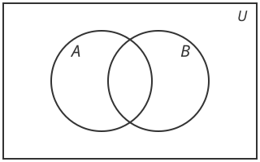
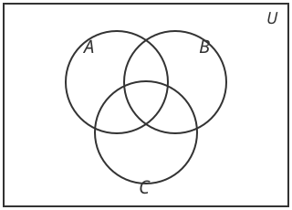
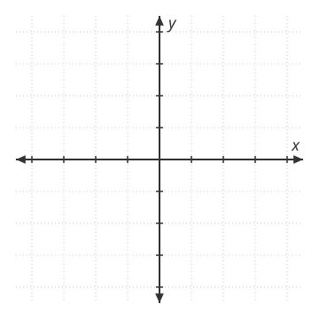

## Introductions
-   Your preferred name and pronouns

-   Why are you here?
    -   Undergrads: why you signed up for this class
    -   Grad students: why you're doing the MA

-   The last math class you took, and roughly when

-   Your comfort food

## Real-Number System

-   *Integers*: $$...,-3,-2,-1,0,1,2,3,...$$

:::: {.incremental}
-   *Fractions*: $$\frac{1}{2}, \frac{3}{5}, -\frac{2}{3}$$

-   *Rational numbers*: ratio of integers

-   *Are fractions rational numbers? What about integers?*
::::

## Real-Number System

-   *Rational numbers*: ratio of integers
    -   "terminating or repeating decimal"
    -   Example. $\frac{1}{3}=0.333$, $\frac{1}{4}=0.25$

::: {.fragment}
-   *Irrational numbers*: cannot be expressed as a ratio of two integers
    -   "nonterminating or nonrepeating decimal"
    -   Example. $\sqrt{2}=1.4142$, $\pi=3.1415$
:::

::: {.fragment}
-   *Real numbers ($\mathbb{R}$)*: rational and irrational
:::

## Sets

-   A *set* is a collection of distinct objects.
    $$A = \{brownies, icecream, pizza, ramen\}$$

-   $pizza \in A$, $\in$ stands for 'is in'

::: {.fragment}
-   What about sets $B$ and $C$?
    $$B = \{x | x \text{ is a positive integer}\}$$
    $$C = \{x | 1<x<5\}$$
:::

## Set Relations {.smaller}

-   Equivalence ($=$) $$A = \{brownies, icecream, pizza, ramen\}$$
    $$B = \{pizza, ramen, icecream, brownies\}$$ $$A = B$$

::: {.fragment}
-   Subset ($\subset$) $$C = \{pizza, ramen\}$$ $C \neq A$ but
    $C \subset A$. Note: $A \supset C$ is equivalent.
:::

::: {.fragment}
*Is $A \subset B$?*
:::

::: {.fragment}
*Yes, but $C$ is a proper subset of $A$.*
:::

## Set Relations

-   Disjoint sets $$A = \{brownies, icecream, pizza, ramen\}$$
    $$D = \{salad, fruits\}$$

::: {.fragment}
-   Neither but still related
    $$A = \{brownies, icecream, pizza, ramen\}$$
    $$E = \{salad, fruits, icecream\}$$
:::

## Set Relations

-   $\emptyset$: empty or null set

::: {.fragment}
-   What are all possible subsets of $S = \{a,b,c\}$?
:::

::: {.fragment}
$\emptyset, \{a\}, \{b\},\{c\}, \{a,b\}, \{b,c\}, \{a,c\}, \{a,b,c\}$
:::

::: {.fragment}
Always $2^n$ subsets. Here $n=3$, so 8 subsets.
:::

## Set Operations

-   *Union:* $A \cup B$, elements in either $A$ *or* $B$

-   *Intersection:* $A \cap B$, elements in both $A$ *and* $B$

Example: $$A = \{brownies, icecream, pizza, ramen\}$$
$$B = \{salad, fruits, icecream\}$$

$A \cup B =$

$A \cap B =$

## Set Operations

-   *Union:* $A \cup B$, elements in either $A$ or $B$

-   *Intersection:* $A \cap B$, elements in both $A$ and $B$

What about $$A = \{brownies, icecream, pizza, ramen\}$$
$$B = \{salad, fruits\}$$

$A \cup B =$

$A \cap B =$

## Set Operations

-   *Complement of $A$*: $\tilde{A}$ or $A^c$, 'not $A$'

-   Universal set $U$ (context specific) then:
    $$A^c = \{x | x \in U \text{ and } x \not\in A\}$$ Example.
    $U=\{1,e,f,2\}, A=\{1,2\}$, then $A^c=\{e,f\}$.

## Set Operations: Venn Diagrams

Shade the following regions:

::: {.columns .figrow}
::: {.column width="33%"}
$A \cup B$

{fig-alt="Blank two-set Venn diagram: sets A and B overlapping inside universal set U" width=340}
:::
::: {.column width="33%"}
$A \cap B$

{fig-alt="Blank two-set Venn diagram: sets A and B overlapping inside universal set U" width=340}
:::
::: {.column width="33%"}
$A^c$

{fig-alt="Blank two-set Venn diagram: sets A and B overlapping inside universal set U" width=340}
:::
:::

## Laws of Set Operations

-   Commutative law
    $$A \cup B = B \cup A \quad \quad  A \cap B = B \cap A$$

-   Distributive law $$A \cup (B \cap C) = (A \cup B) \cap (A \cup C)$$
    $$A \cap (B \cup C) = (A \cap B) \cup (A \cap C)$$

## Distributive law

Verify by shading: $A \cup (B \cap C) = (A \cup B) \cap (A \cup C)$

::: {.columns .figrow}
::: {.column width="50%"}
$A$

{fig-alt="Blank three-set Venn diagram for shading the region A: sets A, B, and C overlapping inside universal set U" width=380}
:::
::: {.column width="50%"}
$B \cap C$

{fig-alt="Blank three-set Venn diagram for shading the region B intersect C: sets A, B, and C overlapping inside universal set U" width=380}
:::
:::

## Distributive law

Now the right-hand side, $(A \cup B) \cap (A \cup C)$:

::: {.columns .figrow}
::: {.column width="50%"}
$A \cup B$

{fig-alt="Blank three-set Venn diagram for shading the region A union B: sets A, B, and C overlapping inside universal set U" width=380}
:::
::: {.column width="50%"}
$A \cup C$

{fig-alt="Blank three-set Venn diagram for shading the region A union C: sets A, B, and C overlapping inside universal set U" width=380}
:::
:::

## Ordered Sets

-   We said order does not matter for sets

-   But we can have ordered sets where
    $$(a,b) \neq (b,a) \text{ unless } a=b$$

-   Ordered pairs, triples,...

Example. $(age, weight)$, $(22,120)$ different from $(120,22)$

## Cartesian Product

$$A = \{1,2\} \quad B = \{3,4\}$$ Cartesian Product: set of all possible
ordered pairs $$A \times B = \{ (1,3), (1,4), (2,3), (2,4) \}$$

## Cartesian Plane

$$\mathbb{R}^2 =  \{(x,y) | x \in \mathbb{R}, y \in \mathbb{R}\}$$

{.nostretch fig-alt="A Cartesian plane: a horizontal x-axis and a vertical y-axis crossing at the origin, each arrowed at both ends and running from negative 4 to 4, over a dotted unit grid" width=330}

Can have $\mathbb{R}^3, \mathbb{R}^4,...,\mathbb{R}^n$

## By the way

What is $x \times x$? What is $x^2 \times x$? What is $x^2 \times x^2$?
More generally, $x^n \times x^m = x^{m+n}$
