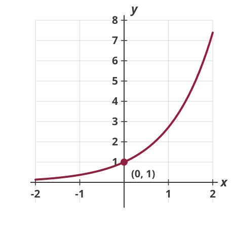
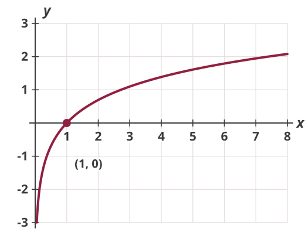

## Example

Total cost: $C=C(Q)$

Marginal cost: $MC = C'(Q)$

Average cost:
$$AC = \frac{C(Q)}{Q}$$

When is $\dfrac{d AC}{d Q}$ positive?

## Example

Revenue: $R=f(Q)$

Output: $Q = g(L)$

How does revenue change due to a change in labor input $L$?
$$\frac{d R}{d L} = \frac{d R}{d Q} \cdot \frac{d Q}{d L}$$

## Exponential Functions

The exponential function can be represented as:
$$y=f(t)=b^{t} \quad (b>1)$$
where $b$ denotes a fixed base of the exponent.

A more generalized version can be written as:
$$y=a b^{c t}$$

## Natural Exponential Function

*Natural exponential function*: the base is a special mathematical constant called Euler's number $e=2.71828...$
$$y=a e^{r t}$$

::: {.fragment}
Where did this number $e$ come from?

It can be shown:
$$e \equiv \lim_{n \rightarrow \infty}\left(1+\frac{1}{n}\right)^{n}$$
:::

## Natural Exponential Function

Jacob Bernoulli discovered this constant in 1683 while studying a question about compound interest.

Invest $A$ dollars at a 5% interest rate that compounds yearly. After one year you have $A(1+0.05)$; after $t$ years:
$$A(1+0.05)^{t}$$

## Natural Exponential Function

After $t$ years: $A(1+0.05)^{t}$. Rewrite this as:
$$A\Bigg(\underbrace{\left(1+\frac{1}{1/0.05}\right)^{1/0.05}}_{\approx\, e}\Bigg)^{0.05t} \approx A e^{0.05t}$$

More generally, with initial principal $A_0$, interest rate $r$, and horizon $t$:
$$A_t \approx A_0 e^{rt}$$

## Logarithmic Function

Since the exponential function is a monotonic function, its inverse exists.

The inverse of the exponential function is called the *log* or *logarithmic* function.

For the exponential function:
$$y=b^{t} \rightarrow \log_b y = t$$

For the natural exponential function:
$$y=e^{t} \rightarrow \log_{e} y = \ln y = t$$

## $y = e^x$

{.nostretch fig-alt="Graph of y equals e to the x for x from negative 2 to 2: a curve that stays just above the x-axis on the left, passes through the point (0, 1), and rises ever more steeply to about 7.4 at x equals 2" width=460}

## $y = \ln x$

{.nostretch fig-alt="Graph of y equals the natural log of x for x from just above 0 to 8: a curve that rises steeply from far below the x-axis near x equals 0, crosses the x-axis at the point (1, 0), and keeps rising ever more slowly to about 2.1 at x equals 8" width=520}

## Rules for Logarithmic Functions

-   $\ln (u v)=\ln u+\ln v$

-   $\ln (u / v)=\ln u-\ln v$

-   $\ln u^{a}=a \ln u$

## Derivatives of Exponential Functions

Derivative of the exponential function:
$$y=e^{t} \quad \rightarrow \quad \frac{dy}{dt} = e^t$$

Using the chain rule:
$$y=e^{f(t)} \quad \rightarrow \quad \frac{dy}{dt} = f'(t) e^{f(t)}$$

## Derivatives of Logarithmic Functions

Derivative of the log function:
$$\frac{d}{d t} \ln t =\frac{1}{t}$$

Using the chain rule:
$$\frac{d}{d t} \ln f(t) =\frac{f'(t)}{f(t)}$$

## Examples

Find the derivatives for the following functions:

1.  $y=e^t$
2.  $y=\ln t$
3.  $y=ae^{rt}$
4.  $y=e^{-t}$
5.  $y=\ln at$
6.  $y=\ln t^{c}$

## Homework Questions

-   Exercise 10.5: 1, 3, 7

Textbook reference: 10.5

Notes on Log and Exponential Functions are on the website
