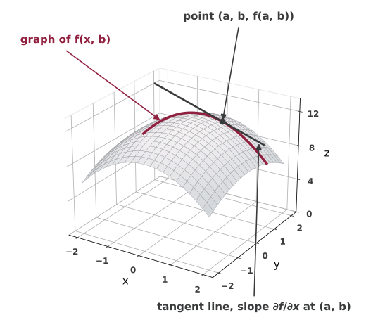

## Partial Differentiation

For a function of several variables:
$$y=f\left(x_{1}, x_{2}, \cdots, x_{n}\right)$$

If $x_1$ changes by $\Delta x_1$ but all other variables remain constant:
$$\frac{\Delta y}{\Delta x_{1}}=\frac{f\left(x_{1}+\Delta x_1, x_{2}, \cdots, x_{n}\right)-f\left(x_{1}, x_{2}, \cdots, x_{n}\right)}{\Delta x_{1}}$$

*Partial derivative* of $y$ with respect to $x_i$:
$$\frac{\partial y}{\partial x_{i}}= f_i = \lim_{\Delta x_{i} \rightarrow 0} \frac{\Delta y}{\Delta x_{i}}$$

## Partial Derivatives

{.nostretch fig-alt="A dome-shaped surface z equals f of x and y over x and y from negative 2 to 2. A maroon curve runs along the surface where y is held fixed at b, labeled graph of f of x and b. A dark dot marks the point (a, b, f(a, b)) on that curve, and a straight line touches the curve at the dot, labeled tangent line, slope partial f over partial x at (a, b)" width=680}

## Gradient Vector

*Gradient*: vector of all partial derivatives of a function

$$\nabla f(x_1, x_2, \cdots, x_n) = [f_1, f_2, \cdots, f_n]^T$$

## Example

$$y=f\left(x_{1}, x_{2}\right)=3 x_{1}^{2}+x_{1} x_{2}+4 x_{2}^{2}$$

$$\frac{\partial y}{\partial x_{1}} = f_1 = \hspace{8em}$$

$$\frac{\partial y}{\partial x_{2}} = f_2 = \hspace{8em}$$

## Example

$$y=f(u, v)=(u+4)(3 u+2 v)$$

$$\frac{\partial y}{\partial u} = f_u = \hspace{8em}$$

$$\frac{\partial y}{\partial v} = f_v = \hspace{8em}$$

## Production Function

$$Q = A K^{\alpha} L^{1-\alpha}$$

Marginal product of capital (MPK):
$$\frac{\partial Q}{\partial K} = Q_K = \hspace{8em}$$

Marginal product of labor (MPL):
$$\frac{\partial Q}{\partial L} = Q_L = \hspace{8em}$$

## Differentials

Note that,
$$\Delta y \equiv\left[\frac{\Delta y}{\Delta x}\right] \Delta x$$

Then for infinitesimal changes,
$$d y \equiv\left[\frac{d y}{d x}\right] d x \quad \text{or} \quad d y=f'(x) d x$$

We will call $d y$ and $dx$ the *differentials* of $y$ and $x$, respectively.

## Derivative as a Ratio

Given that,
$$d y \equiv\left[\frac{d y}{d x}\right] d x \quad \text{or} \quad d y=f'(x) d x$$

We can think of $f'(x)$ as a ratio of two quantities, $dy$ and $dx$.

## Elasticity

An important quantity that economists love to calculate is the *elasticity* of a function.

Elasticity is defined as:
$$\varepsilon = \frac{\text{Percentage change in } y}{\text{Percentage change in } x} = \frac{dy/y}{dx/x}$$

We can calculate this as:
$$\varepsilon = \frac{dy}{dx} \cdot \frac{x}{y}$$

## Elasticity

Elasticity:
$$\varepsilon = \frac{dy}{dx} \cdot \frac{x}{y}$$

-   $|\varepsilon|>1$, elastic

-   $|\varepsilon|=1$, unit elasticity

-   $|\varepsilon|<1$, inelastic

## Example

$$C = a + bY$$

## Total Differential

For a function of $n$ variables
$$y=f\left(x_{1}, x_{2}, \cdots, x_{n}\right)$$

*Total differential*:
$$d f=\frac{\partial f}{\partial x_{1}} d x_{1}+\frac{\partial f}{\partial x_{2}} d x_{2}+\cdots+\frac{\partial f}{\partial x_{n}} d x_{n}=\sum_{i=1}^{n} f_{i} d x_{i}$$

Note: we use $\partial$ to tell partial derivatives apart from total derivatives. In particular,
$$\frac{\partial f}{\partial x_{i}} = \left.\frac{d f}{d x_{i}} \right\vert_{\text{other variables are constant}}$$

## Total Differential

Consider a savings function:
$$S=S(Y, i)$$
where $S$ is savings, $Y$ is national income, and $i$ is the interest rate.

Total differential:
$$d S=\frac{\partial S}{\partial Y} d Y+\frac{\partial S}{\partial i} d i$$

## Example

$$y = 5 x_1^2 + 3x_2$$

## Total Derivative

Total differential:
$$d f= f_1 d x_{1}+ f_2 d x_{2}+\cdots+f_n d x_{n}$$

We can divide the total differential by $dx_1$ to get the *total derivative* of $f$ with respect to $x_1$:
$$\frac{d f}{dx_1} = f_1 + f_2 \cdot \frac{d x_{2}}{d x_{1}}+\cdots+f_n \cdot\frac{d x_{n}}{d x_{1}}$$

## Total Derivative

Given the function
$$y = f(x_1, x_2)$$

We are interested in how $y$ changes with respect to $x_1$, but $x_2$ also depends on $x_1$:
$$x_2 = g(x_1)$$

We know that $dy = f_1 dx_1 + f_2dx_2$. Dividing both sides by $dx_1$,
$$\frac{dy}{dx_1} = f_1+f_2 \cdot g'(x_1) = \frac{\partial y}{\partial x_1} + \frac{\partial y}{\partial x_2} \cdot \frac{d x_2}{dx_1}$$

## A Variation on the Theme

For a function
$$y=f\left(x_{1}, x_{2}, w\right), \quad x_{1}=g(w), \quad x_{2}=h(w)$$

The total derivative of $y$ is given by
$$\frac{d y}{d w}=\frac{\partial f}{\partial x_{1}} \frac{d x_{1}}{d w}+\frac{\partial f}{\partial x_{2}} \frac{d x_{2}}{d w}+\frac{\partial f}{\partial w}$$

## Example

Let a production function be
$$Q(t) = A(t) K(t)^{\alpha} L(t)^{1-\alpha}$$
where
$$K(t) = K_0 + at \qquad L(t) = L_0 + bt$$

## Another Variation on the Theme

If a function is given,
$$y=f\left(x_{1}, x_{2}, u, v\right)$$
with $x_{1}=g(u, v)$ and $x_{2}=h(u, v)$.

Then, holding $v$ constant, the *partial total derivative* with respect to $u$ is
$$\frac{\S y}{\S u}=\frac{\partial y}{\partial x_{1}} \frac{\partial x_{1}}{\partial u}+\frac{\partial y}{\partial x_{2}} \frac{\partial x_{2}}{\partial u}+\frac{\partial y}{\partial u}$$

## Homework Questions

-   Exercise 7.4: 1 (a), (d), 2 (a), (b), 3, 5, 7

-   Exercise 8.1: 1 (a), 4, 6

-   Exercise 8.2: 3 (a), 4, 5, 6, 7 (b), (f)

-   Exercise 8.4: 2, 4

Textbook reference: 7.4, 8.1, 8.2, 8.4

&nbsp;

Reminder: Quiz 2 on Monday.
