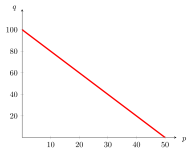
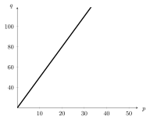
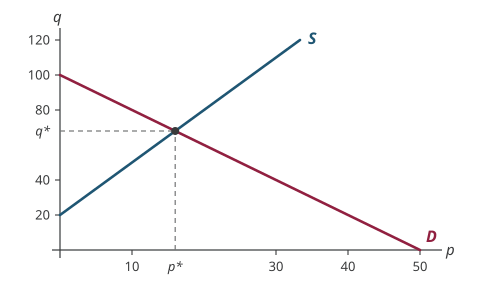

## A Simple Economic Model

$q$: quantity of hats, $p$: price of a single hat\
Demand for hats: $q = 100-2p$\

{fig-alt="Demand curve labelled D for q equals 100 minus 2p: a downward-sloping straight line on axes with price p across and quantity q up, running from q equals 100 at a price of zero down to zero quantity at a price of 50" width=620}

## A Simple Economic Model

$q$: quantity of hats, $p$: price of a single hat\
Supply for hats: $q = 20+3p$\

{fig-alt="Supply curve labelled S for q equals 20 plus 3p: an upward-sloping straight line on axes with price p across and quantity q up, starting at q equals 20 when the price is zero" width=620}

## A Simple Economic Model

$q$: quantity of hats, $p$: price of a single hat\
 \
Demand for hats: $$q = 100-2p$$ Supply for hats: $$q = 20+3p$$\
 \
*Equilibrium*: At what price will both demand and supply be equal?

## Equilibrium

*Equilibrium*: At what price will both demand and supply be equal? $$100-2p = 20+3p \rightarrow  p^* = \$16$$\
 \
What is the quantity traded at this price? $$q ^* = 100-2 \times 16 = 20+3 \times 16 = 68$$\
 \
$q ^*$ and $p^*$ are determined simultaneously.

## Equilibrium

{fig-alt="Demand curve D and supply curve S drawn on the same price-quantity axes, crossing at the equilibrium price p star of 16 and quantity q star of 68, marked by dashed lines to each axis" width=620}

## Matrix Algebra

We solved a *system* of two (linear) equations in two variables.\
 \
Complex economic models: multiple equations with multiple variables\
 \
Hard to just wing it\... Enter, Matrix Algebra!\
 \
Matrix Algebra can help us write complex system of equations compactly and solve them

## A Simple Economic Model

$q$: quantity of hats, $p$: price of a single hat\
 \
Demand for hats: $q = 100-2p$\
 \
Supply for hats: $q = 20+3p$\
 \
Rewrite the two equations: $$\begin{aligned}
q + 2p &= 100 \\ q-3p &= 20
\end{aligned}$$

## A Simple Economic Model

Two equations in two unknowns: $$\begin{aligned}
q + 2p &= 100 \\ q-3p &= 20
\end{aligned}$$

Can write this as $Ax = b$, where $$A = \begin{bmatrix}
1 & 2 \\
1 & -3
\end{bmatrix} \quad
x = \begin{bmatrix}
q \\
p
\end{bmatrix} \quad
b = \begin{bmatrix}
100 \\
20
\end{bmatrix}$$

These arrays are called *matrices*.

## Matrices

A *matrix* is a rectangular array of numbers, parameters, or vectors.

Example. $A = \begin{bmatrix}
2 & 3 & 1 \\
-1 &4 & 6
\end{bmatrix}$

Dimensions of matrix:

-   Number of rows ($m$)

-   Number of columns ($n$)

## Dimension of a Matrix

A matrix with $m$ rows and $n$ columns is referred to as an $m \times n$ matrix\
 \
What's the dimension of $A$?\
 \
$$A = \begin{bmatrix}
2 & 3 & 1 \\
-1 &4 & 6
\end{bmatrix}_{\_\_ \times \_\_}$$

## General Notation

$$A = \begin{bmatrix}
a_{11} & a_{12} & a_{13} & \cdots & a_{1n} \\
a_{21} & a_{22} & a_{23} & \cdots & a_{2n} \\
\vdots & \vdots & \vdots & \vdots & \vdots \\
a_{m1} & a_{m2} & a_{m3} & \cdots & a_{mn} \\
\end{bmatrix}$$

Can write it more compactly $$A = [ a_{ij} ] \quad i=1,2,...,m; j=1,2,...,n$$

## Square Matrices

*Square matrix*: equal number of rows and columns\
 \
Example. $$A = \begin{bmatrix}
a_{11} & a_{12} & a_{13} \\
a_{21} & a_{22} & a_{23} \\
a_{31} & a_{32} & a_{33} \\
\end{bmatrix}_{3\times 3}$$

## Equal Matrices

Two matrices are *equal* if all their elements are identical.\
 \
Example. $$A = \begin{bmatrix}
1 & 8  \\
4 &-1  \\
\end{bmatrix} \neq
 \begin{bmatrix}
1 & 8  \\
4 & 2  \\
\end{bmatrix}$$

So $A=B$ if and only if $a_{ij} = b_{ij}$ for all $i, j$

## Matrix Addition and Subtraction

How to add or take the difference between two matrices?

$\rightarrow$ Element-by-element

$\rightarrow$ Matrices have to have same dimension\
 \

Example. $$A = \begin{bmatrix}
2 & 3 \\
4 & -6 
 \end{bmatrix} \quad \quad
B = \begin{bmatrix}
1 & 8 \\
-2 & 3
\end{bmatrix}$$

What is $A+B$ and $A-B$?

## Scalar Multiplication

How to multiply a scalar to a matrix? $$\lambda \begin{bmatrix} a_{11} & a_{12} & a_{13} \\ 
a_{21} & a_{22} & a_{23} \\  \end{bmatrix} = \begin{bmatrix} \lambda a_{11} & \lambda a_{12} & \lambda a_{13} \\ 
\lambda a_{21} & \lambda a_{22} & \lambda a_{23} \\  \end{bmatrix}$$ Example. $$A = \begin{bmatrix}
2 & 3 \\
4 & -6 
\end{bmatrix}  \quad \quad
B = \begin{bmatrix}
1 & 8 \\
-2 & 3
\end{bmatrix}$$ What is $2B$ and $A-2B$?

## Matrix Multiplication

A whole new animal\...

Only possible to multiply two matrices, $A_{m \times n}$ and $B_{p \times q}$ to get $AB$ if $n = p$ i.e. $$\text{number of columns in } A = \text{ number of rows in } B$$

Example. $A = \begin{bmatrix}
2 & 3 & 1 \\
4 & -6 & -2
\end{bmatrix}_{2 \times 3}$ $B = \begin{bmatrix}
1 & 8 \\
-2 & 3
\end{bmatrix}_{2 \times 2}$

Cannot do $AB$, but can do $BA$

## Matrix Multiplication

Another example. $$A = \begin{bmatrix}
2 & 3 & 1 \\
4 & -6 & -2
\end{bmatrix}_{2 \times 3}
B = \begin{bmatrix}
1 \\
-2 \\
4
\end{bmatrix}_{3 \times 1}$$

Can we multiply $A$ and $B$ to find $C=AB$?

Yes, since $A$ has 3 columns, which is equal to the number of rows in $B$.

Also, the dimension of $C$ will be $2 \times 1$.

## Matrix Multiplication

So how to actually multiply these matrices?

$$C = AB$$ $$c_{ij} = a_{i1} b_{1j} + a_{i2} b_{2j} + ... + a_{in} b_{nj} = \sum_{k=1}^n a_{ik} b_{kj}$$

The *element $c_{ij}$* is obtained by multiplying term-by-term the entries of the *$i$th row of $A$* and *$j$th column of $B$*.

## Matrix Multiplication: Examples

$$A = \begin{bmatrix}
a_{11} & a_{12} &  a_{13} \\
a_{21} & a_{22} &  a_{23} \\
\end{bmatrix}_{2 \times 3}
B = \begin{bmatrix}
b_{11} & b_{12} \\
b_{21} & b_{22} \\
b_{31} & b_{32} \\
\end{bmatrix}_{3 \times 2}$$

Here, $$C = AB = \begin{bmatrix}
 a_{11}b_{11} +  a_{12}b_{21} + a_{13}b_{31} &  a_{11}b_{12} +  a_{12}b_{22} + a_{13}b_{32} \\
  a_{21}b_{11} +  a_{22}b_{21} + a_{23}b_{31} &  a_{21}b_{12} +  a_{22}b_{22} + a_{23}b_{32} \\
\end{bmatrix}_{2 \times 2}$$

## Homework Questions

-   Exercise 4.2: 1, 2, 4

Textbook reference: 4.1, 4.2
