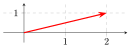
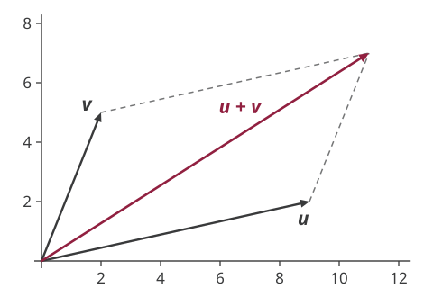

## Matrix Multiplication

A whole new animal\...\
 \
Only possible to multiply two matrices, $A_{m \times n}$ and $B_{p \times q}$ to get $AB$ if $n = p$ i.e. $$\text{number of columns in } A = \text{ number of rows in } B$$\
 \
Example. $A = \begin{bmatrix}
2 & 3 & 1 \\
4 & -6 & -2
\end{bmatrix}_{2 \times 3}$ $B = \begin{bmatrix}
1 & 8 \\
-2 & 3
\end{bmatrix}_{2 \times 2}$\
 \
Cannot do $AB$, but can do $BA$

## Matrix Multiplication

Another example. $$A = \begin{bmatrix}
2 & 3 & 1 \\
4 & -6 & -2
\end{bmatrix}_{2 \times 3}
B = \begin{bmatrix}
1 \\
-2 \\
4
\end{bmatrix}_{3 \times 1}$$\
Can we multiply $A$ and $B$ to find $C=AB$?\
 \
Yes, since $A$ has 3 columns, which is equal to the number of rows in $B$.\
 \
Also, the dimension of $C$ will be $2 \times 1$.

## Matrix Multiplication

So how to actually multiply these matrices?\
 \
$$C = AB$$ $$c_{ij} = a_{i1} b_{1j} + a_{i2} b_{2j} + ... + a_{in} b_{nj} = \sum_{k=1}^n a_{ik} b_{kj}$$

The *element $c_{ij}$* is obtained by multiplying term-by-term the entries of the *$i$th row of $A$* and *$j$th column of $B$*.

## Matrix Multiplication: Examples

$$A = \begin{bmatrix}
a_{11} & a_{12} &  a_{13} \\
a_{21} & a_{22} &  a_{23} \\
\end{bmatrix}_{2 \times 3}
B = \begin{bmatrix}
b_{11} & b_{12} \\
b_{21} & b_{22} \\
b_{31} & b_{32} \\
\end{bmatrix}_{3 \times 2}$$\
Here, $$C = AB = \begin{bmatrix}
 a_{11}b_{11} +  a_{12}b_{21} + a_{13}b_{31} &  a_{11}b_{12} +  a_{12}b_{22} + a_{13}b_{32} \\
  a_{21}b_{11} +  a_{22}b_{21} + a_{23}b_{31} &  a_{21}b_{12} +  a_{22}b_{22} + a_{23}b_{32} \\
\end{bmatrix}_{2 \times 2}$$

## Matrix Multiplication: Examples

$$A = \begin{bmatrix}
2 & 3 & 1 \\
4 & -6 & -2
\end{bmatrix}_{2 \times 3}
B = \begin{bmatrix}
1 \\
-2 \\
4
\end{bmatrix}_{3 \times 1}$$\
 \
$$C = AB =  \begin{bmatrix}
2 \times 1 + 3 \times -2 + 1 \times 4  \\
4 \times 1 + -6 \times -2 + -2 \times 4  \\
\end{bmatrix}_{2 \times 1} = 
\begin{bmatrix}
0  \\
8  \\
\end{bmatrix}_{2 \times 1}$$

## Matrix Multiplication: Examples

$$A = \begin{bmatrix}
1 & 3  \\
2 & 8 \\
4 & 0 \\
\end{bmatrix} \quad
B = \begin{bmatrix}
5 \\
9 \\
\end{bmatrix}$$

## A Simple Economic Model

$$A = \begin{bmatrix}
1 & 2 \\
1 & -3 
\end{bmatrix} \quad 
x = \begin{bmatrix}
q \\
p 
\end{bmatrix} \quad 
b = \begin{bmatrix}
100 \\
20 
\end{bmatrix}$$\
 \
What is $Ax$? $$Ax = \begin{bmatrix}
q + 2p\\
q-3p
\end{bmatrix}$$

Setting $Ax=b$ gives us back our demand and supply equations.

## Vectors

Matrices with only one column: column vectors $$x =  \begin{bmatrix}
x_1\\
x_2 \\
\vdots \\
x_n
\end{bmatrix}$$

Matrices with only one row: row vectors $$x' =  \begin{bmatrix}
x_1 &
x_2 & \cdots &
x_n
\end{bmatrix}$$

## Geometric Representation

Vectors can be graphically represented by arrows

The direction of the arrow indicates the vector's *direction* and the length of the arrow corresponds to its *magnitude*.

Here is a plot for vector $v_1 =  \begin{bmatrix}
2\\
1 \\
\end{bmatrix}$\
 \

{fig-alt="A vector drawn as an arrow from the origin to the point (2, 1) on a grid" width=560}

## Addition of Vectors

{fig-alt="Vector addition by the parallelogram rule: arrows from the origin to (9, 2) and to (2, 5), with dotted lines completing a parallelogram whose far corner is their sum at (11, 7)" width=560}

## Inner Product

Inner product of two vectors each with $n$ elements: $$u \cdot v = u_1 v_1 + u_2 v_2 +...+ u_n v_n = \sum_{i=1}^n u_i v_i$$ Example. $$u = \begin{bmatrix} 1 \\ 5 \\ 2 \end{bmatrix} \quad \quad v = \begin{bmatrix} 2 \\ 1 \\ 3 \end{bmatrix}$$

## Linear Dependence

A set of vectors is said to be *linearly dependent* if and only if any one of them can be expressed as a linear combination of the remaining vectors.\
 \
Example.$$v_1 =  \begin{bmatrix}
1\\
2 \\
\end{bmatrix} \quad \quad v_2 = \begin{bmatrix}
2\\
4 \\
\end{bmatrix}$$

## Linear Dependence

A set of vectors is said to be *linearly dependent* if and only if any one of them can be expressed as a linear combination of the remaining vectors.\
 \
Example.$$v_1 =  \begin{bmatrix}
3\\
2 \\
\end{bmatrix} \quad \quad v_2 = \begin{bmatrix}
1\\
3 \\
\end{bmatrix} \quad \quad v_3 = \begin{bmatrix}
1\\
-4 \\
\end{bmatrix}$$

## Linear Dependence

A set of $m$-vectors $v_1, v_2, ...,v_n$ is linearly dependent if and only if there exists a set of scaler $k_1, k_2, ..., k_n$ (not all zero) such that: $$\sum_{i=1}^n k_i v_i = 0 \quad (m \times 1)$$
