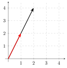
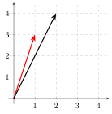
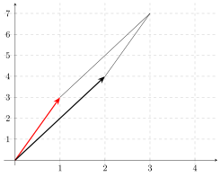

## Inverse of a Matrix

For a **square** matrix $A$, it's inverse $A^{-1}$ is defined as: $$A A^{-1}=A^{-1} A=I$$

Squareness is a *necessary* condition not a *sufficient* condition\
 \
If a matrix's inverse exists, it's called a **nonsingular** matrix

## Properties of Inverses

$$\left(A^{-1}\right)^{-1}=A$$\
 \
$$(A B)^{-1}=B^{-1} A^{-1}$$\
 \
$$\left(A^{\prime}\right)^{-1}=\left(A^{-1}\right)^{\prime}$$

## Solution of Linear-Equation System

$$Ax = b$$

Pre-multiply both sides by $A^{-1}$, $$A^{-1} Ax = A^{-1} b \quad \implies x = A^{-1} b$$

If $A$ is singular, a unique solution does not exist.

## Conditions for Nonsingularity

Squareness is *necessary* but not *sufficient*\
 \
Sufficient condition for nonsingularity:\
 \
*Rows (or equivalently) columns are linearly independent*\
 \
Example. $$A=\left[\begin{array}{ll}
  1 & 2 \\
  2 & 4
  \end{array}\right]
  \quad
  B=\left[\begin{array}{ll}
  1 & 2 \\
  3 & 4
  \end{array}\right]$$ $A$ is singular, $B$ is nonsingular.

## Conditions for Nonsingularity

$$A=\left[\begin{array}{ll}
  1 & 2 \\
  2 & 4
  \end{array}\right]
  \quad  x=\left[\begin{array}{ll}
  x_1 \\
  x_2
  \end{array}\right]
  \quad d=\left[\begin{array}{ll}
  a \\
  b
  \end{array}\right]$$

We have a system of linear equations: $$Ax = d$$ Then, $$x_1+2x_2 = a$$ $$2x_1+4x_2 = b$$

## Conditions for Nonsingularity

$$x_1+2x_2 = a$$ $$2x_1+4x_2 = b$$ For these equations to be consistent, we need $b=2a$: $$x_1+2x_2 = a$$ $$2x_1+4x_2 = 2a$$ Both are the same equation, infinite number of solutions.

## Conditions for Nonsingularity

To summarize, for a matrix to be nonsingular (i.e. its inverse exists):\
 \
Necessary condition: **Squareness**\
 \
Sufficient condition: **Rows or (equivalently) columns are linearly independent**

## Linear Independence

0.5 Linearly Dependent\

0.5 Linearly Independent\

::: {.columns}
::: {.column width="50%"}
Linearly dependent

{fig-alt="Two linearly dependent vectors: arrows from the origin to (2, 4) and to (1, 2) lying along the same line" width=380}
:::
::: {.column width="50%"}
Linearly independent

{fig-alt="Two linearly independent vectors drawn as arrows from the origin pointing in different directions" width=380}
:::
:::

## Rank of a Matrix

Rank of a matrix $=$ maximum number of linearly independent rows\
 \
$$A=\left[\begin{array}{ll}
1 & 2 \\
3 & 4
\end{array}\right]
\quad
B=\left[\begin{array}{ll}
1 & 2 \\
2 & 4
\end{array}\right]$$

Rank of $A$? Rank of $B$?\
 \
Full rank $\iff$ Nonsingularity

## Determinant

Determinant $|A|$ is a unique scalar associated with a *square* matrix $A$.\
 \
Determinant of a $2 \times 2$ Matrix: $$A=\left[\begin{array}{ll}a_{11} & a_{12} \\ a_{21} & a_{22}\end{array}\right]$$ Can be calculated as: $$|A|=a_{11} a_{22}-a_{12} a_{21}$$

## Determinant: Geometric Interpretation

0.25 $$A=\left[\begin{array}{ll}1 & 2 \\ 3 & 4\end{array}\right]$$

0.75

{fig-alt="Geometric interpretation of a determinant: arrows from the origin to (1, 3) and (2, 4) forming two sides of a parallelogram whose area equals the absolute value of the determinant" width=560}

## Determinant of a $3 \times 3$ Matrix

$$\begin{aligned}
|A| &=\left|\begin{array}{lll}
a_{11} & a_{12} & a_{13} \\
a_{21} & a_{22} & a_{23} \\
a_{31} & a_{32} & a_{33}
\end{array}\right| \\~\\
&=a_{11}\left|\begin{array}{ll}
a_{22} & a_{23} \\
a_{32} & a_{33}
\end{array}\right|-a_{12}\left|\begin{array}{ll}
a_{21} & a_{23} \\
a_{31} & a_{33}
\end{array}\right| 
+a_{13}\left|\begin{array}{ll}
a_{21} & a_{22} \\
a_{31} & a_{32}
\end{array}\right|
\end{aligned}$$

## Determinant of a $n \times n$ Matrix

A *minor* of the element $a_{ij}$, denoted by $|M_{ij}|$ is obtained by deleting the $i$th row and $j$th column.\
 \
Cofactor $C_{ij}$ is defined as: $$|C_{ij}| = (-1)^{i+j} |M_{ij}|$$ Then, $$|A| = \sum_{i=1}^n a_{ij} |C_{ij}| = \sum_{j=1}^n a_{ij} |C_{ij}|$$
