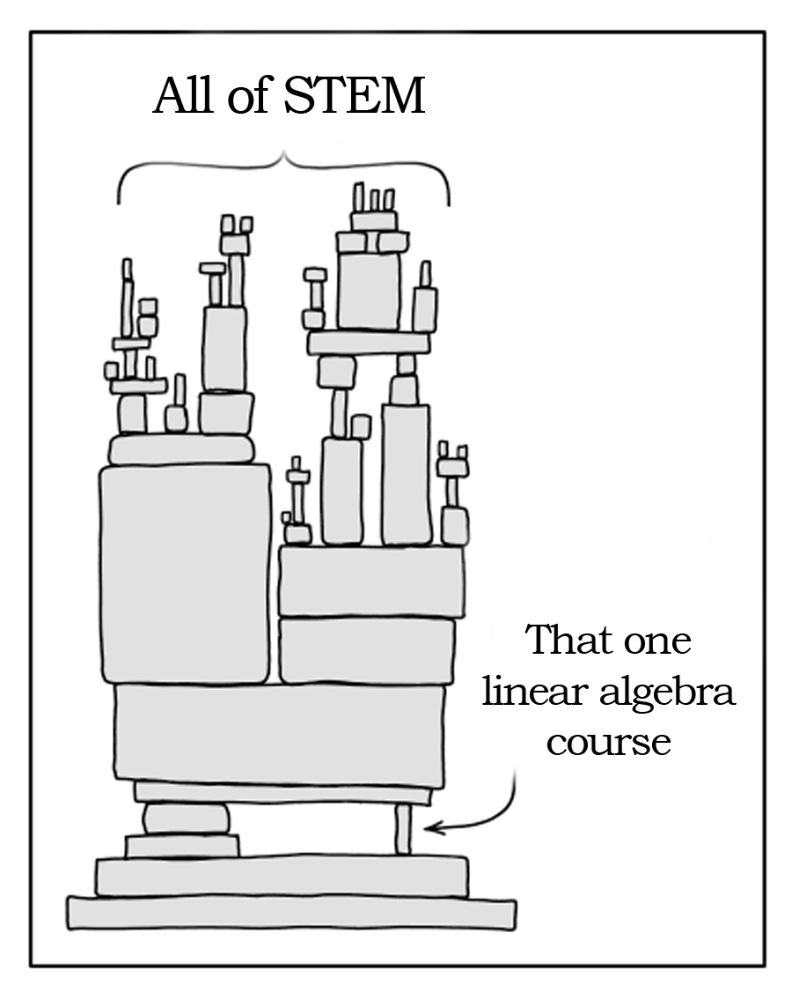
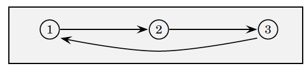

## Find the Determinant

$$A=\left[\begin{array}{ccc}
1 & 5 & 1 \\
0 & 3 & 9 \\
-1 & 0 & 0
\end{array}\right]$$

## Properties of Determinants

$|A| = |A'|$

Interchanging rows or columns will alter the sign but not the value

Multiplication of any one row (or one column) by a scalar $k$ will change the value of the determinant $k$-fold

The addition (subtraction) of a multiple of any row (or column) to (from) another row (or column) will leave the determinant unaltered

If one row (or column) is a multiple of another row (or column), the value of the determinant will be zero.

## Criteria for Nonsingularity

The following statements are equivalent:

$|A| \neq 0$

Rows (or equivalently columns) of $A$ are independent

$A$ has full rank

$A$ is nonsingular

$A^{-1}$ exists

A unique solution to $A x=b$ ($x^*=A^{-1}b$) exists

## Matrix Inversion

*Adjoint* of a nonsingular $n \times n$ matrix\
 \
$$adj A = C' = \left[\begin{array}{llll}
|C_{11}| & |C_{21}| & \cdots & |C_{n1}| \\
|C_{12}| & |C_{22}| & \cdots &  |C_{n2}| \\
\vdots &\vdots & \cdots &  \vdots \\
|C_{1n}| & |C_{2n}| & \cdots & |C_{nn}| \\
\end{array}\right]$$ $$A^{-1} = \frac{1}{|A|} Adj A$$

## Find the Inverse

$$A=\left[\begin{array}{ccc}
3 & 2 \\
1 & 0 \\
\end{array}\right]$$

## Find the Inverse

$$A=\left[\begin{array}{ccc}
1 & 5 & 1 \\
0 & 3 & 9 \\
-1 & 0 & 0
\end{array}\right]$$

## A Simple Economic Model

Two equations in two unknowns: $$\begin{aligned}
q + 2p &= 100 \\ q-3p &= 20
\end{aligned}$$ Can write this as: $$Ax = b$$ where $$A = \begin{bmatrix}
1 & 2 \\
1 & -3 
\end{bmatrix} \quad 
x = \begin{bmatrix}
q \\
p 
\end{bmatrix} \quad 
b = \begin{bmatrix}
100 \\
20 
\end{bmatrix}$$

## Solution using Matrix Inversion

$$A = \begin{bmatrix}
1 & 2 \\
1 & -3 
\end{bmatrix} \quad 
x = \begin{bmatrix}
q \\
p 
\end{bmatrix} \quad 
b = \begin{bmatrix}
100 \\
20 
\end{bmatrix}$$

## Cramer's Rule

More efficient way of solving a system of equations\
 \
The $k$th element of $x$ can be solved by:\
 \
$$x^*_k = \frac{|A_k|}{|A|}$$\
where $A_k$ is a matrix formed by exchanging $k$th column of $A$ by $b$.

## Solution using Cramer's Rule

$$A = \begin{bmatrix}
1 & 2 \\
1 & -3 
\end{bmatrix} \quad 
x = \begin{bmatrix}
q \\
p 
\end{bmatrix} \quad 
b = \begin{bmatrix}
100 \\
20 
\end{bmatrix}$$

## Homogeneous equation system

A homogeneous equation system is given by $$Ax = 0$$ If $A$ is nonsingular, $x^* = A^{-1} 0 = 0$.\
 \
If $A$ is singular there can be infinite number of solutions (this is true for any system of equations).

{fig-alt="Comic showing a precarious tower of blocks labeled 'All of STEM' balancing on one small block labeled 'That one linear algebra course'" width=380}

0.25

## Network Theory

A network of connections can be expressed as an adjacency matrix. $$M=\left(\begin{array}{cccc}
m_{11} & m_{12} & \cdots & m_{1 n} \\
m_{21} & m_{22} & \cdots & m_{2 n} \\
\vdots & \vdots & \ddots & \vdots \\
m_{n 1} & m_{n 2} & \cdots & m_{n n}
\end{array}\right)$$

where $$m_{ij} = \begin{cases}
    1 \quad \text{if there is a direct link from $i$ to $j$} \\
    0 \quad \text{otherwise}
\end{cases}$$

## Network Theory

Consider the following network:

$$M=\left(\begin{array}{lll}
0 & 1 & 0 \\
0 & 0 & 1 \\
1 & 0 & 0
\end{array}\right), \quad M^2=\left(\begin{array}{lll}
0 & 0 & 1 \\
1 & 0 & 0 \\
0 & 1 & 0
\end{array}\right), \quad M^3=\left(\begin{array}{lll}
1 & 0 & 0 \\
0 & 1 & 0 \\
0 & 0 & 1
\end{array}\right)$$

The matrices $M, M^2, M^3$ give the nodes reachable in one, two and threesteps from any initial node.

{fig-alt="A directed network with three nodes: an arrow from node 1 to node 2, an arrow from node 2 to node 3, and an arrow from node 3 back to node 1" width=560}

## Network Theory

Consider the sum: $$S_k = M + M^2 + M^3 +...+M^k$$ The $(i, j)$ element of $S_k$ gives the number of paths of length $k$ orless, from $i$ to $j$.\
 \
For the previous example: $$S_3 = M + M^2 + M^3 = \left(\begin{array}{lll}
1 & 1 & 1 \\
1 & 1 & 1 \\
1 & 1 & 1
\end{array}\right)$$ So there is one way to go from any node to any other in three or fewer steps.

## Uses of Network Theory

Network theory can be used to model\

Interconnectedness of financial institutions (to predict risk of banking collapses)

Interconnectedness of the countries in world trade

Predicting supply chain risk

## Markov Chain

A Markov Chain can model the transition between different states.

Example: Employment (E) and Unemployment (U).

Transition matrix: $$P = \begin{pmatrix}
P(E \rightarrow E) & P(U \rightarrow E) \\
P(E \rightarrow U) & P(U \rightarrow U)
\end{pmatrix}
= \begin{pmatrix}
0.9 & 0.2 \\
0.1 & 0.8
\end{pmatrix}$$

Say the initial state vector is: $$\pi(0) =  \begin{bmatrix}
\pi_E(0)  \\
\pi_U(0)
\end{bmatrix} =  \begin{bmatrix}
0.8  \\
0.2
\end{bmatrix}$$

## Transition Matrix

After one period, the state distribution is: $$\pi(1) = \begin{bmatrix}
\pi_E(1)  \\
\pi_U(1)
\end{bmatrix} = P \pi(0) = \begin{bmatrix}
0.9 & 0.2 \\
0.1 & 0.8
\end{bmatrix} \begin{bmatrix}
0.8  \\
0.2
\end{bmatrix}
 = \begin{bmatrix}
0.76  \\
0.24
\end{bmatrix}$$\
After $t$ periods: $$\pi(t) = P^t \pi(0)$$

## Ordinary Least Squares

Linear model with $k$ variables: $$Y_i = \beta_0 + \beta_1 X_{i1} + \beta_2 X_{i2} + \cdots + \beta_k X_{ik} + \varepsilon_i$$ where $i = 1,...,n$ denotes $n$ observations.\
Denote $$Y  = \begin{bmatrix} Y_1 \\ Y_2 \\  \vdots \\ Y_n  \end{bmatrix}_{n \times 1},    
  \beta  = \begin{bmatrix} \beta_0 \\ \beta_1  \\ \vdots \\ \beta_k \end{bmatrix}_{k \times 1},  
  \boldsymbol{X} = \begin{bmatrix} 1 & X_{11} & \cdots & X_{1k} \\ 1 & X_{12} & \cdots & X_{2k}  \\ \vdots & \vdots \\ 1 & X_{1n} & \cdots & X_{nk}  \end{bmatrix}_{n \times k},  
  \varepsilon  = \begin{bmatrix} \varepsilon_1 \\ \varepsilon_2 \\ \vdots \\ \varepsilon_n  \end{bmatrix}_{n \times 1}$$ Then, $$Y = X \beta + \varepsilon  \quad \quad \text{OLS estimator: } \hat{\beta} = (X'X)^{-1} X'Y$$

## Natural Language Processing (NLP)

Bag of Words (BoW) model is a simple and widely used method in NLP

Transform text into fixed-length vectors by counting how many times each word appears in a document

Example:

-   Doc1: "the cat sat on the mat"

-   Doc2: "the dog sat on the log"

-   Vocabulary for these documents: $[the, cat, sat, on, mat, dog, log]$

-   Vector for Doc1: $[2, 1, 1, 1, 1, 0, 0]$

-   Vector for Doc2: $[2, 0, 1, 1, 0, 1, 1]$

Calculate similarity between document vectors to classify documents into predefined classes

## What's next?

Quiz 2 next week will cover all of Linear Algebra

Notes for reviewing Linear Algebra uploaded (not a substitute for the textbook for understanding concepts)

We will move on to differential calculus next week
