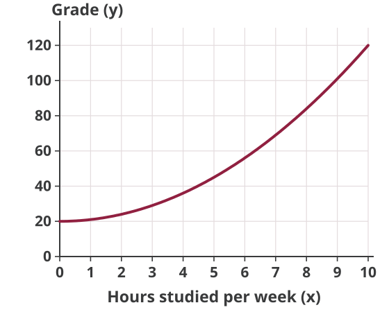
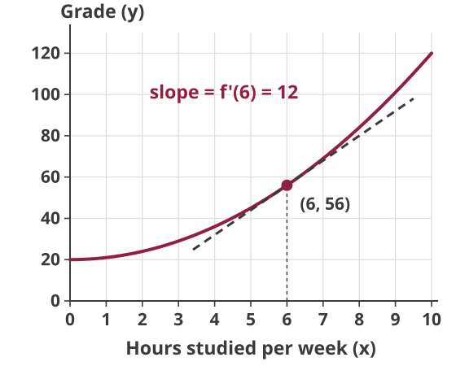
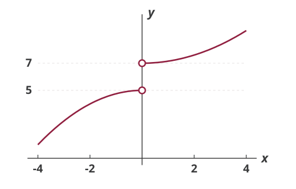
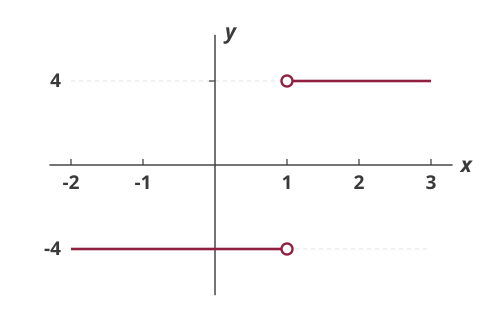

## (Hypothetical) Production Function for Grades

::: {.columns}
::: {.column width="52%"}
{fig-alt="An upward-sloping curve for y equals x squared plus 20, on axes with hours studied across and grades up, rising from 20 at zero hours to 120 at ten hours and getting steeper as hours increase" width=540}
:::
::: {.column width="48%"}
$$y=f(x)=x^{2}+20$$

How much can your grade increase if you study for one additional hour per week?

::: {.fragment}
*Depends on how much you are studying right now!*
:::
:::
:::

## Average Rate of Change

Use $\Delta$ to denote change: $$\Delta x=x_{1}-x_{0}$$

Change in $y$ per unit change in $x$:
$$\frac{\Delta y}{\Delta x}=\frac{f\left(x_{0}+\Delta x\right)-f\left(x_{0}\right)}{\Delta x}$$

## Average Rate of Change

$$y=f(x)=x^{2}+20$$

What happens if you go from 6 to 8 hours of studying?
$$x_0 = 6, \; x_1 = 8 \; \rightarrow \; \Delta x = x_{1}-x_{0}=2$$

Total change in grades: $$f(x_0+\Delta x) - f(x_0) = \hspace{4em}$$

Per hour change in grade:
$$\frac{\Delta y}{\Delta x}=\frac{f\left(x_{0}+\Delta x\right)-f\left(x_{0}\right)}{\Delta x} = \hspace{4em}$$

## The Derivative

Usually we are interested in minuscule changes from $x_0$.

The *derivative* of a function is defined as:
$$\frac{d y}{d x} = f'(x)= \lim_{\Delta x \rightarrow 0} \frac{\Delta y}{\Delta x}$$

Note that $$\frac{\Delta y}{\Delta x}=\frac{f\left(x_{0}+\Delta x\right)-f\left(x_{0}\right)}{\Delta x}$$

## The Derivative

For the function $y=f(x)=x^{2}+20$:
$$\begin{aligned} \frac{\Delta y}{\Delta x}&=\frac{f\left(x_{0}+\Delta x\right)-f\left(x_{0}\right)}{\Delta x} \\
&= \frac{(x_0+\Delta x)^2+20-(x_0^2+20)}{\Delta x} \\
&= \frac{x_0^2+ (\Delta x)^2+2 x_0 \Delta x-x_0^2}{\Delta x} \\
&= 2 x_0 + \Delta x
\end{aligned}$$

Then the derivative is
$$\frac{d y}{d x} = f'(x_0)= \lim_{\Delta x \rightarrow 0} \, (2 x_0 + \Delta x) = 2 x_0$$

## The Derivative

The derivative:
$$\frac{d y}{d x} = f'(x_0)= \lim_{\Delta x \rightarrow 0} \frac{f\left(x_{0}+\Delta x\right)-f\left(x_{0}\right)}{\Delta x}$$

Alternatively,
$$\frac{d y}{d x} = f'(x_0)= \lim_{x \rightarrow x_0} \frac{f(x)-f(x_{0})}{x-x_0}$$

## The Derivative

For the function $y=f(x)=x^{2}+20$:
$$\begin{aligned} \frac{d y}{d x}&= \lim_{x \rightarrow x_0} \frac{f(x)-f(x_{0})}{x-x_0} \\
&= \lim_{x \rightarrow x_0} \frac{x^2+20-x_0^2-20}{x-x_0} \\
&= \lim_{x \rightarrow x_0} \frac{x^2-x_0^2}{x-x_0} \\
&= \lim_{x \rightarrow x_0} \, (x+x_0) = 2x_0
\end{aligned}$$

## Derivative = Slope of the Tangent Line

$$y=f(x)=x^{2}+20 \; \rightarrow \; f'(x) = 2x$$

{.nostretch fig-alt="The same curve for y equals x squared plus 20, with a dashed straight line touching it at the point where x is 6 and y is 56; the tangent line has slope 12, which is f prime of 6" width=500}

## Concept of a Limit

We say that $L$ is the *limit* of $f(x)$ at $a$, i.e.
$$\lim_{x \rightarrow a} f(x) = L$$
if $f(x)$ approaches $L$ as $x$ approaches $a$ from any direction.

Note that we don't actually set $x=a$.

Also, for the limit to exist at a point we need the function to approach the same value from both directions.

## Concept of a Limit

*Left-side limit*: if $x$ approaches $a$ from the left side
$$\lim_{x \rightarrow a^-} f(x)$$

*Right-side limit*: if $x$ approaches $a$ from the right side
$$\lim_{x \rightarrow a^+} f(x)$$

Only when both the left-side and right-side limits have a common finite value do we say that the limit exists.

## Example: Limit Doesn't Exist

{.nostretch fig-alt="A curve in two pieces with a gap at x equals zero: the left piece rises and stops just below the value 5, and the right piece starts just above the value 7 and keeps rising, with open circles at both ends showing the function jumps from 5 to 7" width=560}

## Limit: Another Example

$$f(x) = \frac{4x-4}{\left|x-1\right|}$$

$$\lim_{x \rightarrow 1^-} f(x) = \hspace{6em}$$

$$\lim_{x \rightarrow 1^+} f(x) = \hspace{6em}$$

## Limit: Another Example

{.nostretch fig-alt="The graph of f of x equals four x minus four over the absolute value of x minus one: a horizontal line at negative 4 for x less than 1 and a horizontal line at positive 4 for x greater than 1, with open circles at x equals 1 on both" width=560}

## Homework Questions

-   Exercise 6.2: 2, 3

Textbook reference: 6.2-6.4
