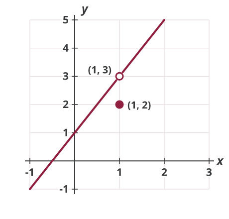
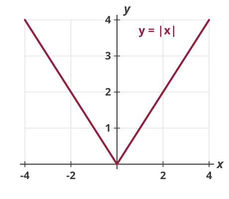

## Continuity of a Function

A function $y=f(x)$ is said to be *continuous* at $a$ if $\lim_{x \rightarrow a} f(x)$ exists and
$$\lim_{x \rightarrow a} f(x) = f(a)$$

## Discontinuity: Example

::: {.columns}
::: {.column width="55%"}
{.nostretch fig-alt="The line y equals 2x plus 1 drawn from x equals negative 1 to x equals 2, with an open circle at the point (1, 3) where the line has a hole, and a filled dot below it at (1, 2) showing the value of the function at x equals 1" width=460}
:::
::: {.column width="45%"}
$$y = \begin{cases} 2x+1 & \text{if } x<1 \\
2 & \text{if } x=1 \\
2x+1 & \text{if } x>1 \end{cases}$$

In this example, the limit exists but the function is not continuous.
:::
:::

## Differentiability and Continuity

$f'(x_0)$ exists if the following limit exists:
$$f'(x_0)= \lim_{x \rightarrow x_0} \frac{f(x)-f(x_{0})}{x-x_0}$$

A function $y=f(x)$ is continuous at $x_0$ if
$$\lim_{x \rightarrow x_0} f(x) = f(x_0)$$

Any connection?

## Differentiability and Continuity

Continuity is a necessary condition for differentiability, but it is not sufficient.

$f$ is not continuous $\Longrightarrow$ $f$ is not differentiable

$f$ is continuous $\Longrightarrow$ $f$ could be differentiable or not

## Continuous but Not Differentiable

::: {.columns}
::: {.column width="55%"}
{.nostretch fig-alt="A V-shaped graph of y equals the absolute value of x for x from negative 4 to 4: a straight line falling to a sharp corner at the origin and rising again, with no break anywhere" width=460}
:::
::: {.column width="45%"}
$$y = |x|$$

This function is continuous but not differentiable.

Note: $|x|$ represents the absolute value of $x$. For example, $|2| =2$ and $|{-2}|=2$.
:::
:::

## So How to Differentiate Functions?

Rules of differentiation, easier than taking the limit each time

*Constant function rule:* for $f(x)=k$, $f'(x)=0$

*Power function rule:* for $f(x)=x^{n}$, $f'(x)=n x^{n-1}$

*Generalized power function rule:* for $f(x)=c x^{n}$, $f'(x)=c n x^{n-1}$

## Rules of Differentiation

Two or more functions of one variable

*Sum-difference rule*
$$\frac{d}{d x}[f(x) \pm g(x)]=f'(x) \pm g'(x)$$

*Product rule*
$$\frac{d}{d x}[f(x) g(x)]=f(x) g'(x)+f'(x) g(x)$$

## Rules of Differentiation

Two or more functions of one variable

*Quotient rule*
$$\frac{d}{d x} \frac{f(x)}{g(x)}=\frac{f'(x) g(x)-f(x) g'(x)}{g(x)^2}$$

*Inverse function rule*
$$\frac{d x}{d y}=\frac{1}{d y / d x}$$

## Rules of Differentiation

Functions of different variables

*Chain rule*: for $z=f(y)$, $y=g(x)$
$$\frac{d z}{d x}=\frac{d z}{d y} \cdot \frac{d y}{d x}=f'(y) g'(x)$$

## Homework Questions

-   Exercise 7.1: 3

-   Exercise 7.2: 3 (d), (e), 7, 8

-   Exercise 7.3: 1-6

Textbook reference: 6.7, 7.1-7.3
